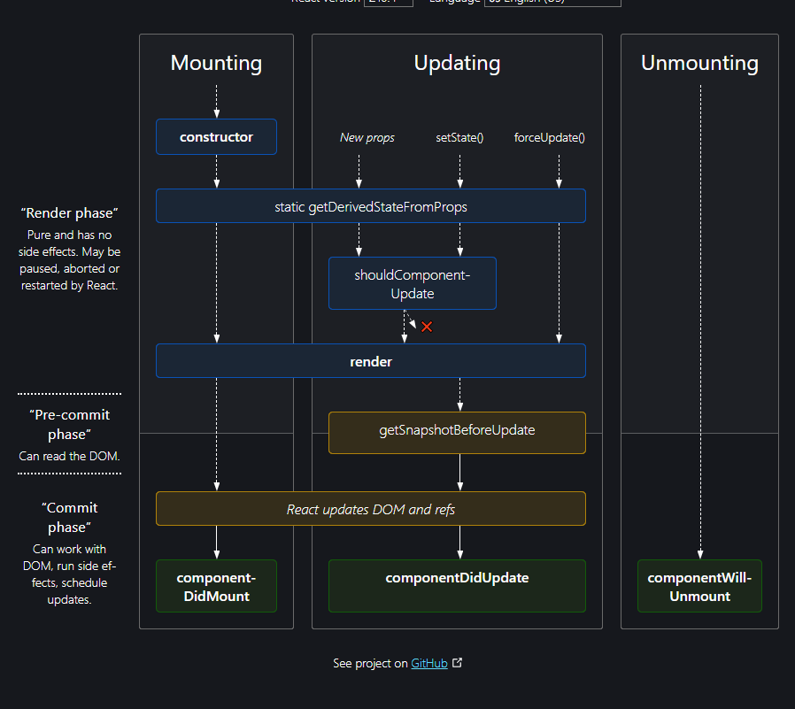
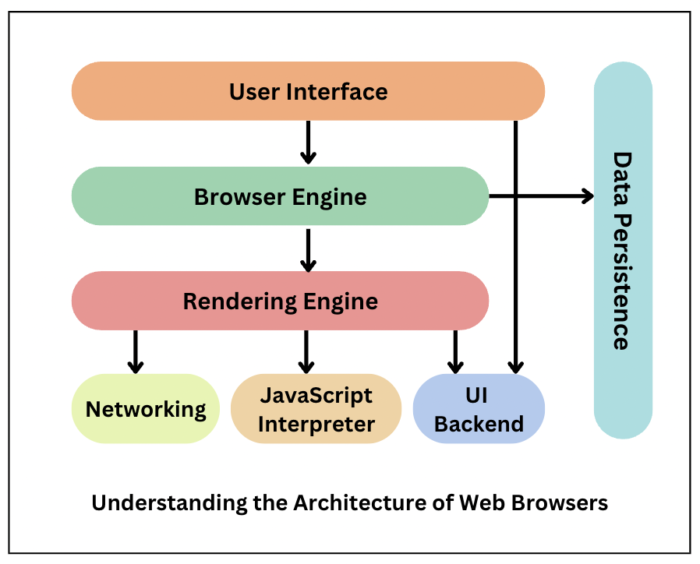

## Essential Skills & Requirements:
 - Experience in building web applications with video playback capabilities  
    +) Split to smaller part and load them when user watch loaded part  
    +) Use CDN to load faster  
    +) Use cache or store in local side. Apply with the resource that often be used  
    
 - Solid knowledge of web technologies (HTML/CSS/JavaScript) and frameworks in building responsive design and cross browser compatible: 
   - using tailwind, bootstrap, not using .....
 - Solid understanding of JavaScript (ES6+): 
   -compare with ES5, ES7, ES12, ...
 - Solid knowledge of React, React-Native, and similar technologies
 - Hands-on experience with popular JavaScript tools, frameworks and design principals, and up to date with the changing JavaScript ecosystem landscape
 - Experience in analyzing UI performance metrics and optimizing the implementation: 
   - how to anal and monitor, ...
 - Ability to perform and influence code reviews as well as technical design meetings: 
   - split to branch, pull request, merge request, review code for younger guys
 - Thorough understanding of Software Development Lifecycle and methodologies
   - What we can push into the Sprint
   - In this Sprint, we have to prepare for next Sprint. Estimate the task, backlog
   - Can fix the issue in the future, write story book, ...

## Preferred Skills & Requirements:
 - Working experience with Scrum or similar agile methodologies
 - Experience with version control systems (e.g. Git) and understanding of branching models & strategies
 - Experience with docker and deployment tools
 - Experience with Xcode and Android Studio.

# Common Topics/Questions:
## React and ecosystem
- **Why React is popular than other library and frameworks?**  
  - Top 3 the most popular Front-end framework/lib in 2022: ReactJs, VueJs, Angular  

|  	| ReactJs 	| VueJs 	| Angular 	|
|---	|---	|---	|---	|---	|
| Advantages 	| - Support by FB<br>- Easy to learn even beginner<br>- Big community<br>- Support a lot of lib<br>- Fast enough for small or big project<br>- Flexible between class or functional style 	| - Is a mix between React and Angular<br>- Two-way binding of Angular, easy to learn of React<br>- Good for SEO<br>- Powerful documentation 	| - Two way binding -> don't care about how re-render<br>- Support by Google<br>- Enhanced server performance<br>- Clearly architecture (MVW Model-View-Whatever)<br>- Easy for readable and testing 	|
| Disadvanctages 	| - Take a lot of time to familiar with JSX<br>- The documentation is not good. Most of solutions come from community 	| - Lack of plugins<br>- Invented after React<br>- Not support by big business so can stop support any time 	| - Hard to learn for beginner<br>- The folder structure is complex 	|
  
- **What is Virtual Dom? how it works and used inside React?**
   - Virtual DOM just an Js Object to revival (tái hiện) real DOM in some moment and it has the same element like real DOM (div, p, span, ...) <=> (Object div, Object p, ...)
   - Virtual DOM is a snapshot (a copy of real DOM) before updating and compare with a snapshot after updated. Thank for `Diffing` algorithm, React will find the difference and skip un-change elements
   - Benefit: VirtualDOM can run on multiple environment because `rendering` thing is split away from real DOM because virtual DOM just a Js Object 
- **What is Reconciliation? Basic operations about reconcilers?**
   - Reconciliation is the way React compare two Virtual DOM trees and decide what PART of elements should be changed. Suppose, we just change the className of component so React will update the className instead re-render this component. If the type of element is different, React will unmount the old component and create a new thing and so the same thing with the children components are inside it. If no different, no change
   - To do that, thank for helping of `Diffing` algorithm
   **Follow the document**
   - Reconciliation an API that you don't need to worry about how React update every element
   - First, whenever component is updated, new different tree is created and React has to figure out the most efficiently way to update the UI match with updated tree
   - Generic solutions finds the minimum elements that have changed however, the complexity of this algorithm is O(n^3) with N is number of elements => Big problem if N becomes a big number
   - To resolve that, React creates a new algorithm with the complexity is O(n)
- **What is main goal for React Fiber?  or How react internally working?** refer [here](https://indepth.dev/posts/1008/inside-fiber-in-depth-overview-of-the-new-reconciliation-algorithm-in-react)
   - **Main goal**: making the animation smooth by using new algorithm to detect exactly what thing should re-render immediately and what thing can be re-render after. Reduce the complexity of Diffing algorithm
   - **Dive deep**
      - From version 16 and higher, React re-write the reconciliation. 
      - From version 15 and above, the algorithm is called `Stack reconciliation` because it works the same with stack (LIFO)
      - The thing that makes difference with `Stack Reconciliation`:
         - Pause the work and come back later if having any work higher priority
         - Assign the priority to different types of work
         - Reuse previous completed work result
         - Abort the work if it's no longer needed
      - So new version of React provides new functions like `matchesPriority(fiber, priority)`, `requestIdleCallback(lowPriorityWork)`, etc
      - Fiber structure can be refer [here](https://gist.githubusercontent.com/velotiotech/e479e75fe701d21d5c21ff3955203a35/raw/153b39a765e8dca79ae82408e2d7dff50a40d870/React-Fiber-type-defs.ts)

- **Keys and why using keys?**
   - Whenever you insert a new element into the list. The index will be changed. Without key, React will compare base on the index of element, compare type and the content inside elements, insert make the index change so the bad case, React will re-render all elements in this list and it's very bad.
   - Key to tell React the position of this element in previous and the next tree so React can increase the performance because it's no need to re-create all elements in the list
   - The key must be unique, stable and predictable. If the ket is unstable, DOM nodes will be unnecessarily re-render and once of causes raise bad performance
   => Shouldn't use key as index because if the list is re-order, index is changed and some elements will be re-render
- **What is Ref in React?**
   - It's a way to access the DOM nodes or React element that created by render method
  
- **Why React use setState behide the screen**
   - When you change the state, React has to re-render this value so if you change the value directly, React won't know when the components should be re-render
- **What is immutable (bất biến) data? Why react state have to be immutable?**
   - To make sure that the UI will updated whenever state change because React will doesn't know when the components should be re-rendered
  
- **Why is it bad to access or mutate the state directly?**
   - if modifying the state directly, it's NOT trigger re-render => the value on UI is NOT updated and all function or calculation NOT re-execute
  
- **How many ways to copy object and what are they?**
   - Spread operator ~ Object.assign()
   - Use JSON.parse(JSON.stringify({}));
   - Pros and cons:
      - JSON.stringify will lost the fields with value is function or promise
      - Spread operator is shallow copy. The value is object still has reference
  
- **how can I render a responsive view? how do you know it has been resized or not?**
   - Using media query of CSS or re-cal the components if size change. To detect size of window is changed, we can add a listener event to window and re-cal if the size of window smaller than a value what we define
  
- **How React portals components work?**
   - It will render component inside the `container` that is the second arg instead render this component as child inside the nearest parent component
   - But the behaviors of this element is the same with other element because it still exist in the React DOM tree. The event is fired inside 'portal' child will be catch by parent component
  
- **How to implement the animation in React**
   - I use CSS only like `animation` or `transform`
   - I hear about `useTransition` in React. Using for page route but I never use

- **Problem solving - how to profile/debug the performance issue and how to resolve?**
   - Use `Profiler API` or React Dev Tool that has Profiler inside so you can know what component takes a lot of time to render (re-render) and how many times

## React Component
- **Functional and Class component difference in React?**
   - Syntax:
      - Functional just a plain function in Js, receive props as params and return a React elements
      - Class must extend the React.Component and using render function to return React elements
   - Life Cycle:
      - Functional doesn't have this thing. We just revival it by using `useEffect`, `useMemo` or `React.memo`, so on
      - Class has life cycle
   - **State**
      - Functional only have the state when we call `useState`
      - Class always have default state no matter you create or not. If you console.log `this` pointer inside the `constructor` method, you will see `state: null`
   - **Ref**
      - Ref always be returned in class component
      - Functional doesn't have this thing
  
- **What does PureComponent do? How is it different from typical traditional class components?**
   - PureComponent and ReactComponent trigger re-render whenever props or state of this component is changed
   - **PureComponent will compare props when parent component re-render, ReactComponent is not**

- **React Component lifecycle?** refer [here](https://projects.wojtekmaj.pl/react-lifecycle-methods-diagram/)
   
   - Second, **mounting** component will be render and mounted in this phase (constructor, getDerivedStateFromProps. render, componentDidMount)
   - Third, **update** the component will be re-render if having any change from props and state or parent updating (getDerivedStateProps. shouldComponentUpdate, getSnapshotBeforeUpdate, componentDidUpdate)
   - Last, **un mounting** component will be remove when it's not used (componentWillUnmount)
  
- **Use-case of using and not using getDerivedStateFromProps, getSnapshotBeforeUpdate**
   - `getDerivedStateFromProps(nextProps, prevState)`: replace and the same function as `componentWillReceiveProps(nextProps)` that will be removed in version 17 because it's not work in async rendering. Called whenever component is created or update props
      - Use case: use when modify the props like cal something with the props and update it to state

   - `getSnapshotBeforeUpdate(prevProps, prevState)`: run after UI is updated, run before `componentDidUpdate(prevProps, prevState, snapshot)` but props or state's value is before rendering happen. Refer [here](https://viblo.asia/p/tim-hieu-vong-doi-cua-react-16-component-phan-2-naQZRW6dlvx)
      - Use case: using to auto scroll to position in chat. Eg: you have new messages => scrollHeight after !== scrollHeight before update => cal and the different inside `getSnapshotBeforeUpdate` and pass value to `componentDidUpdate` => scroll new message here
  
- **How are errors handled in React?**
   - Using `try-catch` to handle logical error
   - To handle the condition inside JSX, I always use condition operator (ternary) and that thing makes sure no exception 
   - Can use `componentDidCatch(err, info)`, it's the same with `getDerivedStateFromError` but is called during "commit" phase so can run side-effect like logging 
   - For common, we can use `getDerivedStateFromError(error)` and return value to update state. We can depend on this state value to handle UI error or not
      *Document: getDerivedStateFromError is invoked after an error has been thrown by a descendant component. It receives the error that was thrown as a parameter and should return a value to update state.*
  
- **What is React events? React events and HTML events differences?**
   - HTML access real DOM and React access Virtual DOM instead
   - HTML events are written is lowercase (onclick, onsubmit), React events are camelCase (onClick, onSubmit)
   - We can add any listener by using external Js but React component have to specify events when creating the component
   - HTML, Bind listener as a string. React, we bind as a variable or function
   <!-- - In HTML, inline event function must has `()` * **Open and Close parenthesis** *. In React, just take the function inside **the curly bracket** `{}` -->

- **React controlled components and uncontrolled components differences?** (refer [here](https://www.youtube.com/watch?v=ecY3QSxZZYY))
   - Controlled component: this component element value are controlled by React state. Element value and state are the same. Follow `single source of truth`
   - Uncontrolled component: the elements are controlled by DOM. Normally, you can use ref to access DOM node and get the value from that. But we have `two source of truth` here
   
- **How to share the common logic across the React component?**
   - Pass the logic function as a prop

- **How to pass the data from parent to child component?**
   - Use `props` to pass data from parent to child
  
### React Hook
- **Rules of Hook?**
   - Only call hook on the top level. Not call inside loop, condition or nest function
   - Only call Hooks from React Functions or custom hook. DO NOT call from regular Js (Benefit: make sure that all stateful logic of this component is clearly visible from its source code)
   - Use ESLint, specific using `eslint-plugin-react-hooks`. That contains two above rules
- **Hook at the very top of document (not inside conditionals) why?**
   - Make sure hooks is called the same order each times component renders
   - Helping React can preserve correctly state of Hook when `useState` and `useEffect` is called
- **How can I use the getSnapshot before updating in the functional component?**
   - use `getSnapshotBeforeUpdate(prevProps, prevState)`, you can do any thing before component is updated. Any value returned by this lifecycle method will be passed as a parameter to `componentDidUpdate()`
   - `componentDidUpdate ` run after that
- **What do react memo do inside react components?**
   - `React.memo` is HOC and it memoizes the passed in components so we can decide re-render the component or not. By default, comparative is shallow compare, we can custom the comparative at second params as a callback
   *NOTE*: HOC is advantage skill in React. It doesn't React API. HOC is a function that receive a component as a param and return other component
- **useMemo and useCallback use cases?**
   - `useCallback(type => {}, deps)` is used when you want to memoize a **function** and return a new function if dependencies is changed => if components is re-render, function is NOT re-created (RETURN FUNCTION)
   - `useMemo(() => val), deps)` is used when you want to re-cal a value (Array, string, etc) and return a new value if dependencies is changed => if components is re-render, value is NOT re-cal (RETURN VALUE)
- **How to implement the memoization function in Javascript (conceptually)? How do you hash dependencies?**
   - Use an global Object as cache. Check this cache whenever you cal any formula => if existed ? get from cache : cal and save to cache
- **How to store the scroll index when the user is scroll the page?**
   - Can save the index to storage because it's not sensitive data
## Browser Engine
   - Browser Engine Flow 

      <!-- - The answer:
         - It's core component, working as a bridge between `User interface` and `Rendering engine`. Handle the rendering engine depends on input received from UI -->

- **Why re-rendering or changing website on the browser is costly? or  How the browser behave when he has a change to the DOM what is the flow?** (refer [here](https://developer.mozilla.org/en-US/docs/Web/Performance/Critical_rendering_path) and [here](https://medium.com/technogise/dom-manipulation-in-browser-59b793bee559))
   - Repaint: 
      - just happen when changing only in the visibility of the element and not for changes in the layout => expensive because it requires browser search though all elements to determine what visible and what should displayed
      - Ex: add outline to elements, change background color, 
   - Reflow:
      - happen when changing the position, dimension of element => more critical then repaint because it's re-cal all element position and dimension, ... => leading to re-render part or all the document
      - Ex: multiple DOM change, display none, visibility: hidden, ...
   ```
   - Additional
      - DOM: construction is incremental. Using token turn into the DOM tree. Single DOM node start with `startTag` and end with `endTag`. This node contains data information about HTML Element. If having a `startTag` and `endTag` inside other `startTag` and `endTag`, we have a child DOM node. *The greater numbers of nodes, the longer following events in CRP will take*

      - CSS Object Model: contains information how to style the DOM, similar with DOM but different. *The browser blocks page rendering until it receives and processes all CSS* because CSS can be overwritten so content can't be rendered until CSSOM is complete

      - Render tree: capture both DOM and CSSOM tree and combine them into render tree. The browser checks every node from root of DOM tree and determine (xác định) which CSS will be attached. *Only capture visible content*

      - Layout: Render tree is built, layout becomes possible. Depend on screen size, determines how elements are positioned on the page, width and height each element, the relation between them. *Layout performance depends on DOM - greater nodes, longer layout take*

      -  Paint: painting the pixel on the screen. Just paint the impacted area, the browser just paint minimum are required
   - Optimizing performance
      - Minimum resource, async un-necessary resource by using async, defer or remove them 
      - Order the critical resources are loaded by priority, shortening the critical path length
   ```
- **why the css transform is way better than margin left-right?** (Refer: https://stackoverflow.com/questions/7108941/css-transform-vs-position)
   - Because transform not break the layout. Margin may break the elements width and height
   - Besides, transform is good for responsive than margin
- **Vector / Frame - reduce lagginess or lightweight - animation engine - image with transparency etc so need to get rid of it to lighten it etc… otherwise in frame, there is lagged animation**
   - How to make svg animation smoother
- **CSS object model?**
   - It's a set of APIs allowing control CSS from Js. The same with DOM but for CSS rather than HTML. Allow to modify CSS dynamic
- **why we should not use the important in CSS?**
   - If all styles use `!important`, nothing is important
   - Un-expect behavior because nothing can higher priority than `!important`
- **How to measure the browser web performance? what are the solution to improve it?**
   - We can use the tool to measure the performance like `pagespeed` or network to check load time each resource of website. Beside that, we have `performance` tab but I never use this :<
   - Improve:
      - Reduce time to call APIs
      - Lazy load the script, lib that is not used immediately 
      - Optimize the image size base on screen width and device
- **Have you use the srcset of an image?**
   - Yeah, not often. I use it for optimize the image, we can define the size of image that will be loaded base on device width
      - `Resolution switching`: different width, different image size
      - `Density switching`: same with resolution but it bases on pixel density instead
      - `Art direction`: different image depend on screen. Can be different images, not just about the image size as two things above
## State management
- **Why are we the state management (Redux)? or why does redux was built? what problem does Redux solve?**
   - Know exactly where state is store, they will be scattered *(rải rác)* everywhere if app doesn't have state management
   - Clearly state update flow and control update by one way flow
   - Easy to understand
- **why Flux is multi stores while redux is only single store?**
   - Store in flux use to specific data. Like PostStore, MessageStore, .... ([Refer Flux](https://www.freecodecamp.org/news/how-to-use-flux-in-react-example/))
   - Redux doesn't follow this way. Redux only has one store but having a lot of reducer. It's the same when you access all store in Flux in one place
- **React Context and Redux. What is the different? what is your prefer?**
   - Different:
      - Context:  
         - This is designed to share data as global state
         - All components inside Context Provider will re-render immediately -> Should create multiple context to manager -> DO NOT update frequency
         - Good for simple flows data changes
      - Redux:
         - Designed for state management purpose -> cover this thing very well -> can update frequency
         - Easy to understand the state change flow because the states are stored one place
   => prefer redux because when app is scaled, we have to use Redux so why don't we use it in the first time?
- **Principles of Redux? Describe the redux workflow?**
   - Principles:
      - Single source of truth: global state of app should be stored in one place. Prevent duplicate data many places and easier to debug and inspect changing
      - State is read-only: only one-way to change state. That dispatches an action. Follow this way, the data is not overwrite by UI, UI just trace the update of state
      - Change are made with pure reducer functions: Reducer function is pure function that receive previous state and an action. Return the next state
   - Redux workflow: view -> dispatch action -> update state in store -> re-render view -> ...

- **Why reducers were invited in the first place?**
   - Reducers used to monitor and manager state flow. You can dispatch an action and return data after update so that why it's very important
   *Build to guard the data and monitor/control the side effects*
- **Provide solutions for not re-render component when the redux store change**
   - use hook selector to select exactly the state that is used by components. Not select a bigger state
- **Create your own middleware with Redux?**
   - Middleware is triggered before reducer receives an action AND after an action is dispatched
- **How can I make an Ajax request (api request) with redux?**
   - We can use Redux-thunk and handle async action like AJAX and `dispatch` an action after AJAX request done
- **Why Redux Thunk easier than Saga?**
   - Redux thunk is easier to setup, very simple because you can handle and update to store by `dispatch` in a function. Familiar with native Js code by using promise or async/await
      - Cons: with complexity logical or big business rule, take a lot of code in a function, hard to test
   - Saga use helper function to let redux know what it should it do in next step, using generator function to stop and execute other thing before continue. At least, we have to setup saga an reducer to handle two different ways, saga for side effect, reducer to update state in store
- **Redux Saga? Why is it invented how is it different from Redux Thunk or something like that? Side effect tasks?**
   - In redux-thunk, we can handle the side-effect inside action using vanila Js, handle Promise, so on and dispatch inside immediately after everything is done
      => With more complex logical, the code is very big and not clearly so we have saga
   - In saga, action just send the type of action and payload. After that, saga will listen to dispatch event, using helper function like call, fork, ... to handle side-effect to dispatch other action to update the state 
      => The flow is very clearly but take a lot of time to understand and setup
- **How saga work in basically?**
   - Saga uses for handle side effect like call API, read, write file, etc
   - Main sage splits into two different things: workers & watchers
      - Watchers: watching every action that is dispatched to redux store. If it matches with one of actions, this action will be assigned to workers
- **Use generator for such purpose and why do we use generator functions?**
   - Saga ALWAYS listen so we have to use generator to stop and start the action
   - generator function make your code look more synchronous => easy to read, write and test
- **Saga: What are differences between call and put action?**
   - `call` blocks the effect. Waiting for promise resolved before moving to next step
   - `put` NOT block effect and saga can move to next step. `Action` will be dispatched internal
## Server side rendering
- **Have you working with NextJS?**

- **How to render the data on server side?**
   - NextJs mode: Next.js has two forms of pre-rendering: Static Generation and Server-side Rendering. The difference is in when it generates the HTML for a page.
      - Static Generation:
         - is the pre-rendering method that generates the HTML at build time. The pre-rendered HTML is then reused on each request and served by CDN
         - Fetch data in build time and become a static site by using `getStaticProps()`
      - Server-side Rendering
         - is the pre-rendering method that generates the HTML on each request.
         - Using `getServerSideProps(context)` to fetch data each time user request to server
            *'context' contains request specific parameter*
   => So if we don't need to pre-render with data in server side. We can served static site and fetch data in client-side using Js

   ```
   - `getServerSideProps`: use for SSR, never run on browser. Pass data to component as props
   - `getStaticProps`: use for SSG (static site generation)
   - `getInitialProps`: working as `componentDidMount` but can working with SSR
   ```
- **Enhance (improve) SEO**
   - Improve keyword
   - Repeat the keyword several times in the page, highlight them, good content for user => bot will mark it's good content for user => improve SEO
   - Update content regular
   - Provide more detail in meta data like `<meta name="keywords">`, `<meta name="description>`, .... Good for bot can understand the website
   - Always use `alt` attributes for images or videos
- **What is semantic HTML?**
   - They are semantic elements that clearly describes meaning for developer and browser
      - E.g: section tag define a thematic grouping of content, typically with a heading 
   *Thẻ HTML ứng với nội dung được chứa như thẻ section (chia ra các phần riêng biệt của thẻ HTML), article (chứa các nội dung độc lập, bao gôm đầy đủ ngữ cảnh), nav (chưa các thẻ điều hướng đến các section cụ thể trong trang), aside, header, footer, div, main, body*

## Security
- **How to check the NPM packages vulnerability?**
   - Using `npm audit` command to check the vulnerability of all packages in project
   - How to fix vulnerability
      - Update the latest version each package
      - Run recommend command to check
      - Run `npm audit fix`, 
- **Have you worked with Synk**
   - No, Iam not. I try to find out something about Synk and know that it's a security platform. Find out the bug or vulnerability 
## Mobile development and other
- When the libraries is deprecated, how to refactor or enhancement code?
- Have you worked with PWA?
- Communication between native mobile app and webview (web app)
- Build, Sign app with key, Uploading APK store?
- Did you write in objective C or anything Apple Native / Swift?
- Deal with Android studio and xCode?
- How do you learn new tech or new library? (twitter channel, documentations, articles research, online course platforms, youtube conference for react etc…)
